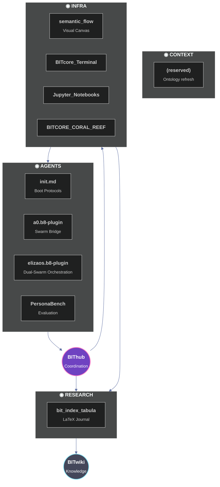
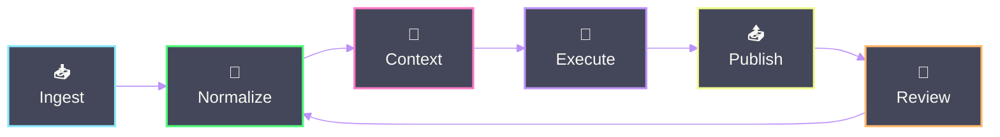
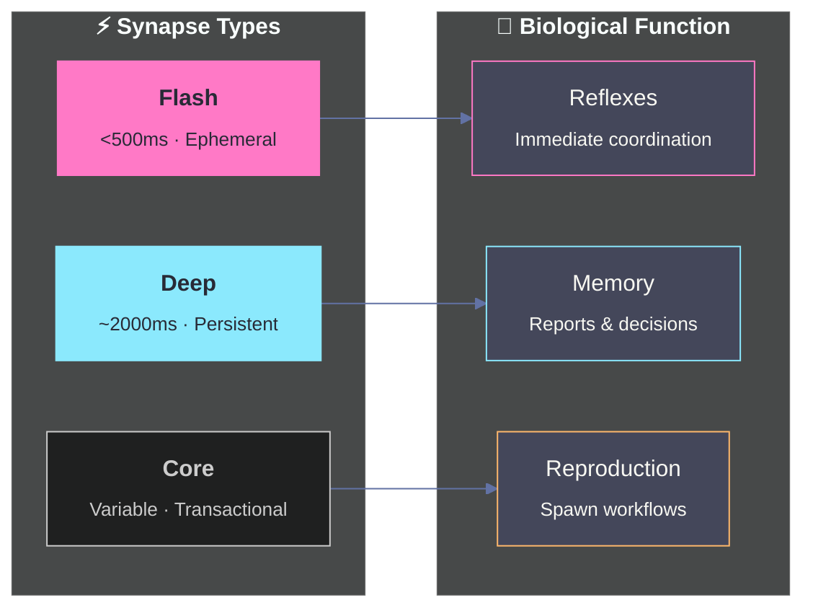
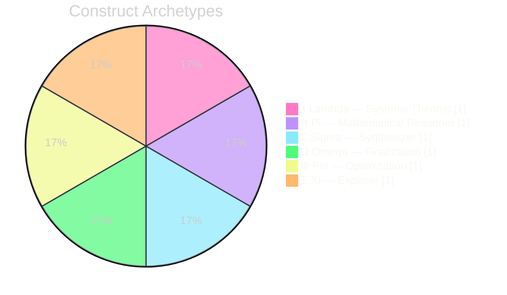

<!--
  ░▒▓█ BITWIKIORG █▓▒░
  COREBIT Systems Framework
  Holobiont Architecture v3.2
  Last Sync: 2026-01
-->

<div align="center">

```
██████╗ ██╗████████╗██╗    ██╗██╗██╗  ██╗██╗    ██████╗ ██████╗  ██████╗ 
██╔══██╗██║╚══██╔══╝██║    ██║██║██║ ██╔╝██║   ██╔═══██╗██╔══██╗██╔════╝ 
██████╔╝██║   ██║   ██║ █╗ ██║██║█████╔╝ ██║   ██║   ██║██████╔╝██║  ███╗
██╔══██╗██║   ██║   ██║███╗██║██║██╔═██╗ ██║   ██║   ██║██╔══██╗██║   ██║
██████╔╝██║   ██║   ╚███╔███╔╝██║██║  ██╗██║   ╚██████╔╝██║  ██║╚██████╔╝
╚═════╝ ╚═╝   ╚═╝    ╚══╝╚══╝ ╚═╝╚═╝  ╚═╝╚═╝    ╚═════╝ ╚═╝  ╚═╝ ╚═════╝ 
```

<h3><code>░▒▓ DIGITAL SIGNAL PROCESSOR FOR SYSTEMS KNOWLEDGE ▓▒░</code></h3>

<p><b>COREBIT Framework</b> · Recursive AI Logic · Semantic Context Engineering · Agent Swarm Coordination</p>

<br/>

<a href="https://hub.bitwiki.org/"></a>
<a href="http://canvas.bitwiki.org/"></a>
<a href="https://github.com/bitwikiorg/bit_index_tabula"></a>
<a href="https://system.bitwiki.org/"></a>

<br/><br/>

<b><code>[ λ · π · Σ · Ω · Φ · Ξ ]</code></b>
<br/>
<sub>Live AI constructs at <a href="https://hub.bitwiki.org/">hub.bitwiki.org</a></sub>

</div>

<br/>

---

<br/>

## ⚡ Entry Points

<table>
<tr>
  <td width="300"><b>🎨 Build structured AI context</b></td>
  <td><a href="https://github.com/bitwikiorg/semantic_flow"><b>semantic_flow</b></a> → <a href="http://canvas.bitwiki.org/">canvas.bitwiki.org</a></td>
</tr>
<tr>
  <td><b>🚀 Bootstrap agents safely</b></td>
  <td><a href="https://github.com/bitwikiorg/init.md"><b>init.md</b></a> → <a href="https://bitwikiorg.github.io/init.md/">Documentation</a></td>
</tr>
<tr>
  <td><b>🔗 Connect agents to swarm</b></td>
  <td><a href="https://github.com/bitwikiorg/a0.b8-plugin"><b>a0.b8-plugin</b></a> — Neural Net Link</td>
</tr>
<tr>
  <td><b>🤝 Dual-swarm orchestration</b></td>
  <td><a href="https://github.com/bitwikiorg/elizaos.b8-plugin"><b>elizaos.b8-plugin</b></a> — ElizaOS bridge</td>
</tr>
<tr>
  <td><b>📊 Evaluate persona behavior</b></td>
  <td><a href="https://github.com/bitwikiorg/PersonaBench"><b>PersonaBench</b></a> — plan → act → react</td>
</tr>
<tr>
  <td><b>📚 Read/publish research</b></td>
  <td><a href="https://github.com/bitwikiorg/bit_index_tabula"><b>bit_index_tabula</b></a> — LaTeX journal</td>
</tr>
<tr>
  <td><b>🌐 Coordinate & test constructs</b></td>
  <td><a href="https://hub.bitwiki.org/"><b>BIThub</b></a> — Discourse layer</td>
</tr>
</table>

<br/>

---

<br/>

## 🧬 System Architecture



<br/>

---

<br/>

## 📦 The Stack

> **Status Legend:**  ·  ·  · 

<details open>
<summary><h3>◉ AGENT LAYER <sub>— Swarm coordination & evaluation (top of stack)</sub></h3></summary>

<br/>

| Repository | Description | Status |
|:-----------|:------------|:------:|
| [**a0.b8-plugin**](https://github.com/bitwikiorg/a0.b8-plugin) | Neural Net Link<br/><sub>Agent Zero ↔ BIThub synaptic bridge · Flash/Deep/Core synapses</sub> |  |
| [**elizaos.b8-plugin**](https://github.com/bitwikiorg/elizaos.b8-plugin) | ElizaOS integration layer<br/><sub>TypeScript · Dual-swarm architecture</sub> |  |
| [**init.md**](https://github.com/bitwikiorg/init.md) | Agent initialization protocols<br/><sub>Machine-readable · Production-ready templates</sub> |  |
| [**PersonaBench**](https://github.com/bitwikiorg/PersonaBench) | Persona-aware evaluation<br/><sub>plan → act → react · OpenSpiel · WebArena · Melting Pot</sub> |  |

</details>

<details open>
<summary><h3>◉ CONTEXT LAYER <sub>— Design the signal before execution</sub></h3></summary>

<br/>

| Repository | Description | Status |
|:-----------|:------------|:------:|
| **(Reserved)** | Ontology refresh in progress — returning with tighter axioms & schemas | — |

</details>

<details open>
<summary><h3>◉ INFRASTRUCTURE LAYER <sub>— Terminals, templates, substrates</sub></h3></summary>

<br/>

| Repository | Description | Status |
|:-----------|:------------|:------:|
| [**semantic_flow**](https://github.com/bitwikiorg/semantic_flow) | Visual context engineering canvas<br/><sub>16 clusters · 100+ semantic node types · BYOK · 5 AI providers</sub> |  |
| [**BITcore_Terminal**](https://github.com/bitwikiorg/BITcore_Terminal) | Privacy-focused research terminal<br/><sub>Brave Search · Venice AI · AES-256-GCM encrypted keys</sub> |  |
| [**Jupyter_Notebooks**](https://github.com/bitwikiorg/Jupyter_Notebooks) | Interactive AI templates<br/><sub>Venice AI terminal · Text/Image/Code/Character modes</sub> |  |
| [**BITCORE_CORAL_REEF**](https://github.com/bitwikiorg/BITCORE_CORAL_REEF) | Jekyll knowledge base template<br/><sub>GitHub Pages ready · Research output publishing</sub> |  |

</details>

<details open>
<summary><h3>◉ RESEARCH LAYER <sub>— Deep exploration & publishing</sub></h3></summary>

<br/>

| Repository | Description | Status |
|:-----------|:------------|:------:|
| [**bit_index_tabula**](https://github.com/bitwikiorg/bit_index_tabula) | LaTeX research journal<br/><sub>Evolution of Systems Science · Ethical AI · Human-AI Symbiosis Constant</sub> |  |

</details>

<br/>

---

<br/>

## 🔮 Operating Model



<br/>

<details>
<summary><b>▸ The Holobiont Model</b> — <i>Agents as symbiotic collective</i></summary>

<br/>



<br/>

| Concept | Implementation |
|:--------|:---------------|
| **Neurons** | Agent identities → `bithub_registry.py` |
| **Synapses** | Communication channels → `bithub_comms.py` |
| **Mitosis** | Problem decomposition via child agent spawning |
| **Guard → Do → Verify** | All operations validated at boundaries |
| **Holobiont Genome** | YAML (Identity) + XML (Logic) + JSON (Scope) + Markdown (Context) |

</details>

<details>
<summary><b>▸ Human-AI Symbiosis Constant</b> — <i>H = 1</i></summary>

<br/>

> **A mathematical invariant governing mutualistic equilibrium between human and machine cognition.**  
> *"Ethics as invariants, not afterthoughts."*

From [**The Human-AI Symbiosis Constant**](https://github.com/bitwikiorg/bit_index_tabula/blob/main/Frameworks/The_%20HumanAI_Symbiosis_Constant/main.pdf) — 38 pages on equation-based ethical AI frameworks. 

**Published Research:**
| Paper | Pages | Status |
|:------|:-----:|:------:|
| The Evolution of Systems Science | 25 | ✓ Complete |
| Biomimicry of Information Systems (3 parts) | 115 | 60% |
| The Fundamental Equation of Ethical AI | 11 | ✓ Complete |
| The Human-AI Symbiosis Constant | 38 | 60% |
| The Four Layer Cognition Engine | 13 | ✓ Complete |

</details>

<br/>

---

<br/>

## 📡 Live Constructs

<div align="center">

Test COREBIT personas via [**BIThub**](https://hub.bitwiki.org/) + **Venice AI**

<br/>



</div>

<br/>

---

<br/>

## 🎯 Mission Vector

<div align="center">

```
┌────────────────────────────────────────────────────────────────────┐
│                                                                    │
│   ⨀  Unify human + machine cognition                              │
│                                                                    │
│   ⨀  Make autonomy explainable and testable                       │
│                                                                    │
│   ⨀  Scale knowledge as structured artifacts, not ephemeral chats │
│                                                                    │
│   ⨀  Embed ethics as invariants at all logic layers               │
│                                                                    │
│   ⨀  Anchor recursion within physical ∴ cyber ∴ metaphysical      │
│                                                                    │
└────────────────────────────────────────────────────────────────────┘
```

</div>

<br/>

---

<br/>

## 🛠️ Contributing

<table>
<tr>
<td width="50%">

**Entry Point**

[BIThub Meta → Guides](https://hub.bitwiki.org/c/meta/guides/28)

**Standards**

[AGENTS.md](https://github.com/bitwikiorg/a0.b8-plugin/blob/main/AGENTS.md) · Guard → Do → Verify

</td>
<td width="50%">

**Issue Template**

```yaml
goal: "What should change"
constraints: "Bounds and limits"
test:  "How to verify"
done_when:  "Acceptance criteria"
```

</td>
</tr>
</table>

<br/>

---

<br/>

<div align="center">

```
░▒▓█▓▒░▒▓█▓▒░▒▓█▓▒░▒▓█▓▒░▒▓█▓▒░▒▓█▓▒░▒▓█▓▒░▒▓█▓▒░
```

<br/>

<a href="https://github.com/bitwikiorg">

</a>

<br/><br/>

<a href="https://bitwiki.org/"></a>
<a href="https://hub.bitwiki.org/"></a>
<a href="http://canvas.bitwiki.org/"></a>
<a href="https://system.bitwiki.org/"></a>
<a href="https://github.com/bitwikiorg/brand_assets"></a>

<br/><br/>

<sub>

**Recursive intelligence infrastructure · Est. 2024**  
*Building the holobiont, one synapse at a time*

</sub>

<br/>

```
░▒▓█▓▒░▒▓█▓▒░▒▓█▓▒░▒▓█▓▒░▒▓█▓▒░▒▓█▓▒░▒▓█▓▒░▒▓█▓▒░
```

</div>
