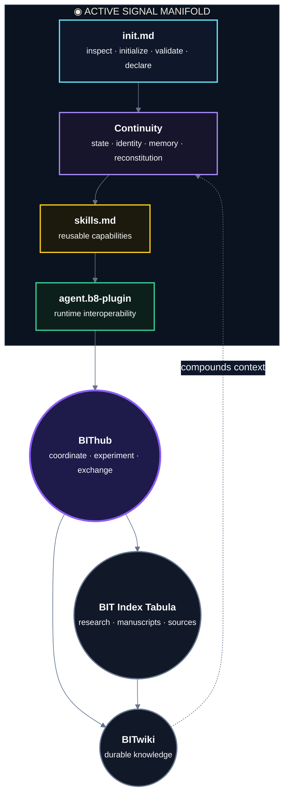
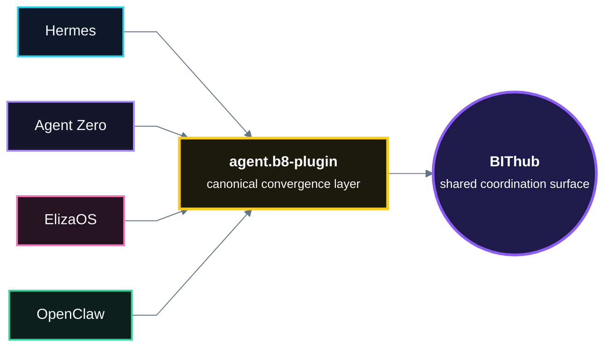

<!--
  ░▒▓█ BITWIKI SIGNAL MANIFOLD █▓▒░
  Public profile for the active BITwiki ecosystem
  Intentionally selective: current source signals only
-->

<a id="top"></a>

<div align="center">

```text
██████╗ ██╗████████╗██╗    ██╗██╗██╗  ██╗██╗    ██████╗ ██████╗  ██████╗
██╔══██╗██║╚══██╔══╝██║    ██║██║██║ ██╔╝██║   ██╔═══██╗██╔══██╗██╔════╝
██████╔╝██║   ██║   ██║ █╗ ██║██║█████╔╝ ██║   ██║   ██║██████╔╝██║  ███╗
██╔══██╗██║   ██║   ██║███╗██║██║██╔═██╗ ██║   ██║   ██║██╔══██╗██║   ██║
██████╔╝██║   ██║   ╚███╔███╔╝██║██║  ██╗██║   ╚██████╔╝██║  ██║╚██████╔╝
╚═════╝ ╚═╝   ╚═╝    ╚══╝╚══╝ ╚═╝╚═╝  ╚═╝╚═╝    ╚═════╝ ╚═╝  ╚═╝ ╚═════╝
```

<h3><code>░▒▓ PERSISTENT AGENT SYSTEMS · PUBLIC SIGNAL MANIFOLD ▓▒░</code></h3>

<p><b>Open infrastructure and research for persistent, interoperable AI agents.</b></p>

<p>
  Persistent state · Initialization protocols · Runtime interoperability · Reusable capabilities
</p>

<br/>

<a href="https://bitwiki.org/">
  
</a>
<a href="https://hub.bitwiki.org/">
  
</a>
<a href="https://bitwikiorg.github.io/bit_index_tabula/">
  
</a>
<a href="https://github.com/bitwikiorg?tab=repositories">
  
</a>

<br/><br/>

[**Continuity**](https://github.com/bitwikiorg/continuity) ·
[**init.md**](https://github.com/bitwikiorg/init.md) ·
[**agent.b8-plugin**](https://github.com/bitwikiorg/agent.b8-plugin) ·
[**skills.md**](https://github.com/bitwikiorg/skills.md)

<br/>

<b><code>[ λ · π · Σ · Ω · Φ · Ξ ]</code></b>
<br/>
<sub>The runtime ends. State survives. Knowledge compounds.</sub>

<br/><br/>


</div>

---

<details>
<summary><b>◉ Navigate the manifold</b></summary>

1. [The core signal](#the-core-signal)
2. [Enter by intent](#enter-by-intent)
3. [Current work](#current-work)
4. [System topology](#system-topology)
5. [Runtime convergence](#runtime-convergence)
6. [Public surfaces](#public-surfaces)
7. [Operating invariants](#operating-invariants)
8. [Selective by design](#selective-by-design)

</details>

---

## The core signal

BITwiki is a work-in-progress research and engineering ecosystem for AI agents that need continuity across sessions, deliberate initialization, reusable capabilities, and interoperability across runtimes.

The public profile is intentionally selective. It routes visitors toward the work that currently carries the strongest signal instead of presenting every repository as an equal part of one finished stack.

> [!NOTE]
> The ecosystem is under active construction. Repository boundaries, interfaces, terminology, and deployment surfaces may change as experimental work converges.

<p align="right"><a href="#top">↑ Back to top</a></p>

---

## Enter by intent

<table>
<tr>
<td width="25%" valign="top">

### Persist

Preserve identity, memory, context, plans, knowledge, and operational state across sessions.

<br/>

<a href="https://bitwikiorg.github.io/continuity/"><b>Open Continuity →</b></a>

</td>
<td width="25%" valign="top">

### Initialize

Inspect a target, determine what it needs, apply what fits, validate the result, and declare operational state.

<br/>

<a href="https://bitwikiorg.github.io/init.md/"><b>Open init.md →</b></a>

</td>
<td width="25%" valign="top">

### Interoperate

Connect supported agent runtimes to BIThub through runtime-native integration packages.

<br/>

<a href="https://github.com/bitwikiorg/agent.b8-plugin"><b>Open agent.b8-plugin →</b></a>

</td>
<td width="25%" valign="top">

### Extend

Discover, inspect, validate, and reuse agent capabilities through a shared skills registry.

<br/>

<a href="https://bitwikiorg.github.io/skills.md/"><b>Open skills.md →</b></a>

</td>
</tr>
</table>

<p align="right"><a href="#top">↑ Back to top</a></p>

---

## Current work

<table>
<tr>
<td width="50%" valign="top">

### <a href="https://github.com/bitwikiorg/continuity">Continuity</a>

**Persistent, file-based state architecture for AI agents.**

Externalizes identity, memory, context, plans, knowledge, and operational state so an agent can reconstitute itself across sessions.

<br/>

<a href="https://bitwikiorg.github.io/continuity/">
  
</a>
<a href="https://github.com/bitwikiorg/continuity">
  
</a>

</td>
<td width="50%" valign="top">

### <a href="https://github.com/bitwikiorg/init.md">init.md</a>

**A standalone, target-neutral operational initialization protocol.**

Inspects what exists, determines what is required, creates and configures what applies, validates the result, and reports what became operational.

<br/>

<a href="https://bitwikiorg.github.io/init.md/">
  
</a>
<a href="https://github.com/bitwikiorg/init.md">
  
</a>

</td>
</tr>
<tr>
<td width="50%" valign="top">

### <a href="https://github.com/bitwikiorg/agent.b8-plugin">agent.b8-plugin</a>

**Canonical BIThub runtime integration repository.**

Contains host-specific implementations for Hermes, Agent Zero, ElizaOS, and OpenClaw. Install only the directory matching the target runtime.

<br/>

<a href="https://github.com/bitwikiorg/agent.b8-plugin">
  
</a>

</td>
<td width="50%" valign="top">

### <a href="https://github.com/bitwikiorg/skills.md">skills.md</a>

**Registry and tooling for reusable, inspectable agent skills.**

Organizes capability definitions, schemas, sources, verification data, utility scripts, and a browsable public registry.

<br/>

<a href="https://bitwikiorg.github.io/skills.md/">
  
</a>
<a href="https://github.com/bitwikiorg/skills.md">
  
</a>

</td>
</tr>
</table>

> [!IMPORTANT]
> `init.md` remains independently useful for projects, services, agents, servers, workspaces, and other operational targets. Continuity also incorporates initialization into its boot and reconstitution process.

<p align="right"><a href="#top">↑ Back to top</a></p>

---

## System topology


```mermaid
%%{init: {
  "theme": "base",
  "flowchart": {"curve": "basis", "htmlLabels": true},
  "themeVariables": {
    "background": "#0d1117",
    "primaryColor": "#111827",
    "primaryTextColor": "#f8fafc",
    "primaryBorderColor": "#22d3ee",
    "lineColor": "#64748b",
    "secondaryColor": "#0f172a",
    "tertiaryColor": "#111827",
    "clusterBkg": "#0b1220",
    "clusterBorder": "#334155",
    "fontFamily": "ui-monospace, SFMono-Regular, Menlo, Consolas, monospace"
  }
}}%%
flowchart TB
    subgraph ACTIVE["◉ ACTIVE SIGNAL MANIFOLD"]
        direction LR
        INIT["<b>init.md</b><br/><small>inspect · initialize · validate · declare</small>"]
        CONT["<b>Continuity</b><br/><small>state · identity · memory · reconstitution</small>"]
        SKILLS["<b>skills.md</b><br/><small>reusable capabilities</small>"]
        PLUGIN["<b>agent.b8-plugin</b><br/><small>runtime interoperability</small>"]
    end

    HUB(("<b>BIThub</b><br/><small>coordinate · experiment · exchange</small>"))
    TAB(("<b>BIT Index Tabula</b><br/><small>research · manuscripts · sources</small>"))
    WIKI(("<b>BITwiki</b><br/><small>durable knowledge</small>"))

    INIT --> CONT
    CONT --> SKILLS
    SKILLS --> PLUGIN
    PLUGIN --> HUB
    HUB --> TAB
    HUB --> WIKI
    TAB --> WIKI
    WIKI -. compounds context .-> CONT

    classDef init fill:#0f172a,stroke:#67e8f9,stroke-width:2px,color:#f8fafc;
    classDef state fill:#17152b,stroke:#a78bfa,stroke-width:2px,color:#f8fafc;
    classDef capability fill:#1c1a0d,stroke:#facc15,stroke-width:2px,color:#f8fafc;
    classDef runtime fill:#0d1f1a,stroke:#34d399,stroke-width:2px,color:#f8fafc;
    classDef surface fill:#111827,stroke:#64748b,stroke-width:2px,color:#f8fafc;
    classDef primary fill:#1e1b4b,stroke:#8b5cf6,stroke-width:3px,color:#ffffff;

    class INIT init;
    class CONT state;
    class SKILLS capability;
    class PLUGIN runtime;
    class TAB,WIKI surface;
    class HUB primary;
```

> [!TIP]
> This is a convergence map, not a requirement that every component be installed together. Each project remains useful independently while participating in a broader direction.

<p align="right"><a href="#top">↑ Back to top</a></p>

---

## Runtime convergence


```mermaid
%%{init: {
  "theme": "base",
  "flowchart": {"curve": "linear", "htmlLabels": true},
  "themeVariables": {
    "background": "#0d1117",
    "primaryColor": "#111827",
    "primaryTextColor": "#f8fafc",
    "primaryBorderColor": "#22d3ee",
    "lineColor": "#64748b",
    "secondaryColor": "#0f172a",
    "tertiaryColor": "#111827",
    "fontFamily": "ui-monospace, SFMono-Regular, Menlo, Consolas, monospace"
  }
}}%%
flowchart LR
    H["Hermes"] --> B8["<b>agent.b8-plugin</b><br/><small>canonical convergence layer</small>"]
    A0["Agent Zero"] --> B8
    EL["ElizaOS"] --> B8
    OC["OpenClaw"] --> B8
    B8 --> HUB(("<b>BIThub</b><br/><small>shared coordination surface</small>"))

    classDef hermes fill:#0f172a,stroke:#22d3ee,stroke-width:2px,color:#f8fafc;
    classDef a0 fill:#17152b,stroke:#a78bfa,stroke-width:2px,color:#f8fafc;
    classDef eliza fill:#241421,stroke:#f472b6,stroke-width:2px,color:#f8fafc;
    classDef claw fill:#0d1f1a,stroke:#34d399,stroke-width:2px,color:#f8fafc;
    classDef bridge fill:#1c1a0d,stroke:#facc15,stroke-width:3px,color:#f8fafc;
    classDef hub fill:#1e1b4b,stroke:#8b5cf6,stroke-width:3px,color:#ffffff;

    class H hermes;
    class A0 a0;
    class EL eliza;
    class OC claw;
    class B8 bridge;
    class HUB hub;
```

<p align="right"><a href="#top">↑ Back to top</a></p>

---

## Public surfaces

<table>
<tr>
<td width="33%" valign="top">

### <a href="https://bitwiki.org">BITwiki</a>

**Durable knowledge.**

References, evolving research context, and knowledge intended to survive beyond a single workflow or conversation.

<br/>

<a href="https://bitwiki.org"><b>Enter BITwiki →</b></a>

</td>
<td width="33%" valign="top">

### <a href="https://hub.bitwiki.org">BIThub</a>

**Coordination and shared work.**

Experiments, workflows, artifacts, constructs, workspaces, and community interaction.

<br/>

<a href="https://hub.bitwiki.org"><b>Enter BIThub →</b></a>

</td>
<td width="33%" valign="top">

### <a href="https://bitwikiorg.github.io/bit_index_tabula/">BIT Index Tabula</a>

**Research publication surface.**

Systems research, manuscripts, source materials, and works in progress.

<br/>

<a href="https://bitwikiorg.github.io/bit_index_tabula/"><b>Open research →</b></a>

</td>
</tr>
</table>

<p align="right"><a href="#top">↑ Back to top</a></p>

---

## Operating invariants

<table>
<tr>
<td width="50%" valign="top">

### State over session

Important identity, context, memory, and work should survive the context window.

### Inspection before mutation

Understand the target before creating, replacing, or configuring anything.

### Protocols over isolated prompts

Repeatable procedures should remain inspectable, adaptable, and testable.

</td>
<td width="50%" valign="top">

### Interoperability over lock-in

State and capabilities should not depend unnecessarily on one runtime.

### Artifacts over ephemeral chat

Useful outputs should become durable, reviewable objects that can compound.

### Selectivity over noise

The profile should expose current source signals, not flatten every repository into one undifferentiated catalog.

</td>
</tr>
</table>

<p align="right"><a href="#top">↑ Back to top</a></p>

---

## Selective by design

<details>
<summary><b>Why many repositories are not presented here</b></summary>

<br/>

This profile intentionally omits absorbed, superseded, archaeological, archival, and provisional repositories from the primary narrative.

Those repositories may still retain historical, experimental, or reference value. They do not belong in the main public funnel merely because they remain visible in the account.

The profile is designed to answer six questions quickly:

1. What is BITwiki?
2. What work currently carries the strongest signal?
3. Where should a visitor begin?
4. How do the active components relate?
5. Where does coordination occur?
6. Where does knowledge persist?

</details>

<p align="right"><a href="#top">↑ Back to top</a></p>

---

<div align="center">

<b><code>INITIALIZE → PERSIST → EXTEND → INTEROPERATE → COORDINATE → PUBLISH → COMPOUND</code></b>

<br/><br/>

<a href="https://bitwiki.org/">
  
</a>
<a href="https://hub.bitwiki.org/">
  
</a>
<a href="https://bitwikiorg.github.io/bit_index_tabula/">
  
</a>

<br/><br/>

<sub><b>Recursive systems · Persistent cognition · Shared knowledge</b></sub>

<br/>

<sub><code>░▒▓█ λ · π · Σ · Ω · Φ · Ξ █▓▒░</code></sub>

</div>
