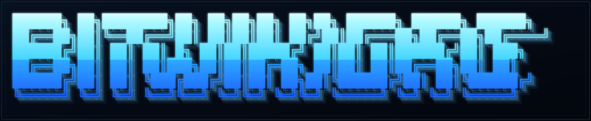

<!--
  BITWIKI / PUBLIC ECOSYSTEM PROFILE
  Current work only. Historical and absorbed repositories remain discoverable
  through the repository index without competing with the primary entry points.
-->

# BITwiki

**Open infrastructure for agents that persist, interoperate, and compound.**

 