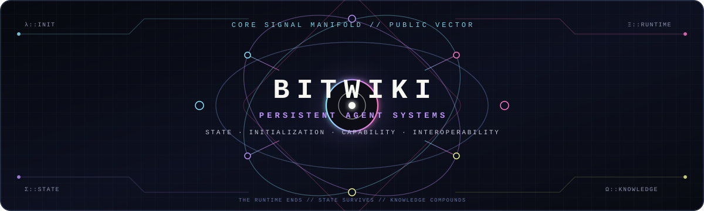
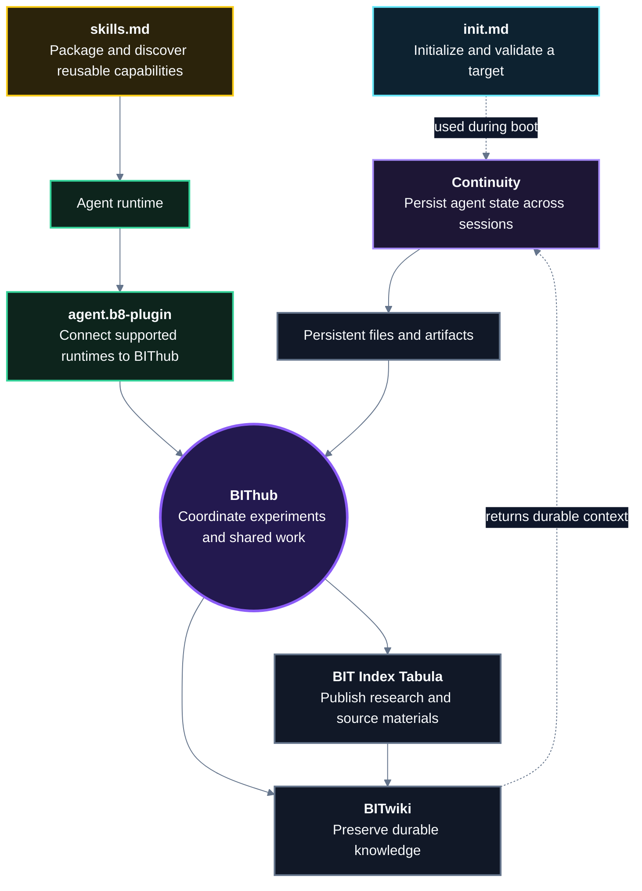

<!--
  BITWIKI / PUBLIC ECOSYSTEM PROFILE
  Current work only. Historical, absorbed, and provisional repositories remain
  discoverable through the repository index without competing with active entry points.
-->

# BITwiki

**Open infrastructure for persistent, interoperable agent systems.**

 

  

[**Persist an agent**](#persist) · [**Initialize a target**](#initialize) · [**Connect a runtime**](#interoperate) · [**Add capabilities**](#capabilities) · [**Explore the ecosystem**](#public-surfaces)

 

The runtime ends. State survives. Work resumes. Knowledge compounds.

---

## What BITwiki is

BITwiki is a *work-in-progress research and engineering ecosystem* for **persistent, inspectable, and interoperable agent systems**.

It addresses four concrete problems:

1. **Session loss:** agents lose identity, memory, context, and unfinished work when a runtime stops;
2. **Blind initialization:** projects and agents are changed before existing state, constraints, and dependencies are inspected;
3. **Capability duplication:** useful procedures are repeatedly rebuilt instead of being represented as inspectable, reusable skills;
4. **Runtime isolation:** agents remain enclosed inside separate runtimes instead of connecting to shared coordination and knowledge surfaces.

> [!NOTE]
> The ecosystem is under active construction. Repository boundaries, interfaces, and terminology may change as the work converges.

<a href="#top">↑ Back to top</a>

---

## Start with the problem you have

> [!TIP]
> Each project can be used independently. Start with the problem in front of you rather than installing the entire ecosystem.

### 01 · Your agent must remember and resume its work

## Use [Continuity](https://github.com/bitwikiorg/continuity)

**Continuity** externalizes agent identity, memory, context, plans, knowledge, tasks, and operational state into files that survive session boundaries. Use it when an agent must *wake up, reconstruct its working state, and continue* instead of restarting from zero.

 

### 02 · You need to initialize a target without guessing

## Use [init.md](https://github.com/bitwikiorg/init.md)

**init.md** is a standalone protocol for inspecting a target, determining what it needs, creating and configuring only what applies, validating the result, and reporting what became operational. It can initialize agents, projects, services, servers, and workspaces. *Continuity also uses initialization during boot and reconstitution.*

 

### 03 · You need one integration for your agent runtime

## Use [agent.b8-plugin](https://github.com/bitwikiorg/agent.b8-plugin)

**agent.b8-plugin** is the canonical repository for connecting supported agent runtimes to BIThub. Select only the runtime-specific directory that matches the host.

<kbd>Hermes</kbd> <kbd>Agent Zero</kbd> <kbd>ElizaOS</kbd> <kbd>OpenClaw</kbd>

 

### 04 · Your agent needs capabilities that can be inspected and reused

## Use [skills.md](https://github.com/bitwikiorg/skills.md)

**skills.md** organizes reusable agent capabilities as inspectable definitions with sources, schemas, verification data, and supporting scripts. Use the public registry to discover capabilities and the repository to inspect how they are represented.

<a href="#top">↑ Back to top</a>

---

## How the active work connects

```mermaid
%%{init: {
  "theme": "base",
  "flowchart": {"curve": "basis", "htmlLabels": true},
  "themeVariables": {
    "background": "#0d1117",
    "primaryColor": "#111827",
    "primaryTextColor": "#f8fafc",
    "primaryBorderColor": "#22d3ee",
    "lineColor": "#64748b",
    "secondaryColor": "#0f172a",
    "tertiaryColor": "#111827",
    "clusterBkg": "#080d16",
    "clusterBorder": "#334155",
    "fontFamily": "ui-monospace, SFMono-Regular, Menlo, Consolas, monospace"
  }
}}%%
flowchart TB
    INIT["<b>init.md</b><br/>Initialize and validate a target"]
    CONT["<b>Continuity</b><br/>Persist agent state across sessions"]
    SKILLS["<b>skills.md</b><br/>Package and discover reusable capabilities"]
    PLUGIN["<b>agent.b8-plugin</b><br/>Connect supported runtimes to BIThub"]
    RUNTIME["Agent runtime"]
    ARTIFACTS["Persistent files and artifacts"]
    HUB(("<b>BIThub</b><br/>Coordinate experiments and shared work"))
    TAB["<b>BIT Index Tabula</b><br/>Publish research and source materials"]
    WIKI["<b>BITwiki</b><br/>Preserve durable knowledge"]

    INIT -. "used during boot" .-> CONT
    CONT --> ARTIFACTS
    SKILLS --> RUNTIME
    RUNTIME --> PLUGIN
    PLUGIN --> HUB
    ARTIFACTS --> HUB
    HUB --> TAB
    HUB --> WIKI
    TAB --> WIKI
    WIKI -. "returns durable context" .-> CONT

    classDef init fill:#0d2230,stroke:#67e8f9,stroke-width:2px,color:#f8fafc;
    classDef state fill:#1d1635,stroke:#a78bfa,stroke-width:2px,color:#f8fafc;
    classDef capability fill:#2b230b,stroke:#facc15,stroke-width:2px,color:#f8fafc;
    classDef runtime fill:#0d241c,stroke:#34d399,stroke-width:2px,color:#f8fafc;
    classDef neutral fill:#111827,stroke:#64748b,stroke-width:2px,color:#f8fafc;
    classDef primary fill:#23194f,stroke:#8b5cf6,stroke-width:3px,color:#ffffff;

    class INIT init;
    class CONT state;
    class SKILLS capability;
    class PLUGIN,RUNTIME runtime;
    class ARTIFACTS,TAB,WIKI neutral;
    class HUB primary;
```

> [!IMPORTANT]
> The diagram shows relationships, not a mandatory installation order. `init.md`, Continuity, `skills.md`, and `agent.b8-plugin` remain independently useful.

<a href="#top">↑ Back to top</a>

---

## Explore the ecosystem

### [BITwiki](https://bitwiki.org) · Read durable knowledge

Browse **evolving knowledge, references, and research context** intended to persist beyond individual conversations and experiments.

### [BIThub](https://hub.bitwiki.org) · Coordinate and experiment

Use BIThub for **workflows, artifacts, shared work, agent experiments, discussions, and coordination** across the ecosystem.

### [BIT Index Tabula](https://bitwikiorg.github.io/bit_index_tabula/) · Inspect research in progress

Read systems research, manuscripts, source materials, and draft publications while the research layer continues to develop.

<a href="#top">↑ Back to top</a>

---

## Operating principles

1. **Persistence over reconstruction**  
   Preserve identity, context, memory, and unfinished work so agents resume instead of repeatedly rebuilding themselves.

2. **Inspection over assumption**  
   Read the target before mutating it. Existing state, constraints, and dependencies are part of the system.

3. **Protocols over prompt fragments**  
   Represent recurring procedures as inspectable, versioned, and testable operational artifacts.

4. **Interoperability over enclosure**  
   Keep useful state and capabilities portable enough to cross runtime boundaries.

5. **Artifacts over transience**  
   Convert valuable outputs into durable objects that can be reviewed, reused, and extended.

6. **Compounding over repetition**  
   Let state, capabilities, and knowledge accumulate rather than resetting the work at every session.

<a href="#top">↑ Back to top</a>

---

### Continue into the system

[**Persist an agent**](https://bitwikiorg.github.io/continuity/) · [**Initialize a target**](https://bitwikiorg.github.io/init.md/) · [**Connect a runtime**](https://github.com/bitwikiorg/agent.b8-plugin) · [**Browse skills**](https://bitwikiorg.github.io/skills.md/) · [**Enter BIThub**](https://hub.bitwiki.org/) · [**Read BITwiki**](https://bitwiki.org/) · [**Watch BITwiki**](https://www.youtube.com/@BITwikiorg)

 

<b>Recursive systems · Persistent cognition · Shared knowledge</b>

